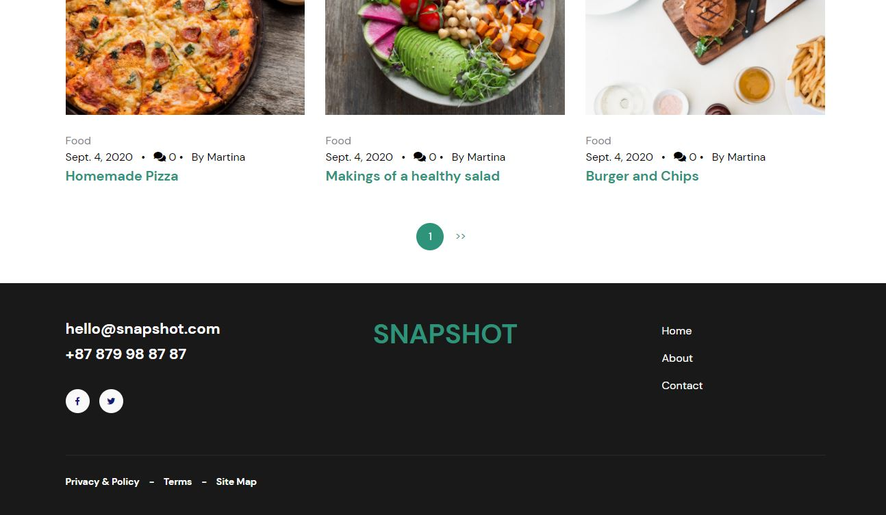
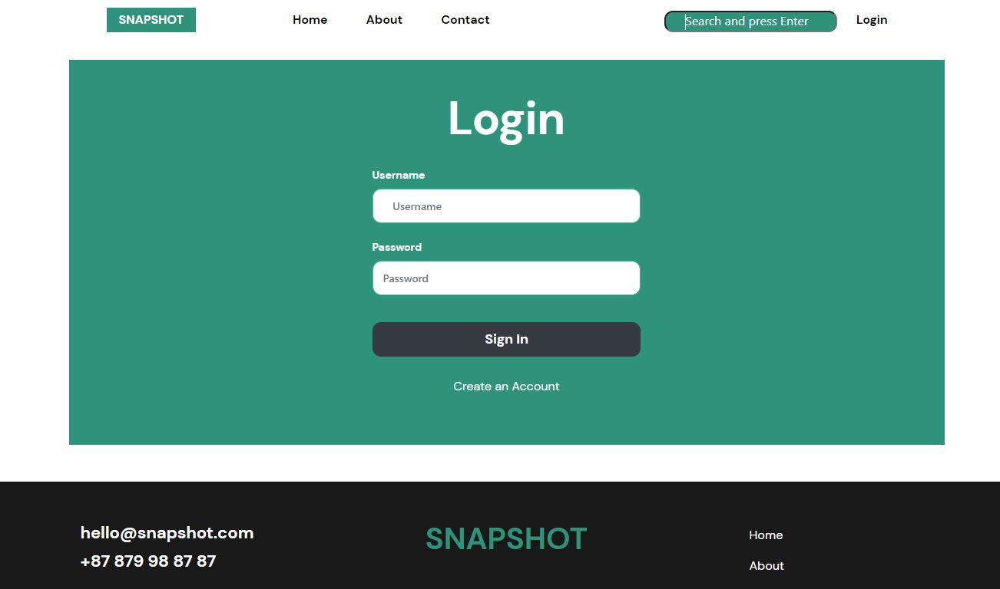
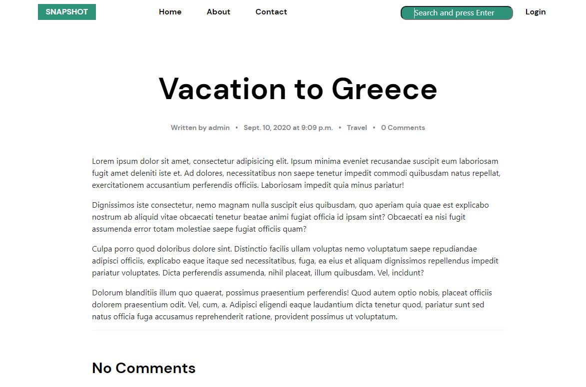
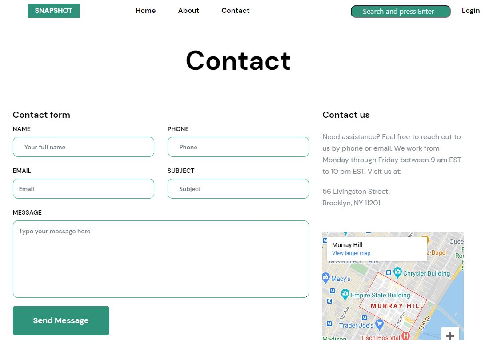

In this project, I built a blog application with django framework, docker and bootstrap.
Individual users can create, delete, update their own posts as well as add comments.

To run the application:

1. Run docker using 'docker-compose up -d --build'
2. In your browser, go to 127.0.0.1:8000
3. Create an account to add, update, delete post

For backend details:
USERNAME: admin
PASSWORD: testpass123

Below are some screenshots:
1. Homepage - Header

2. Homepage - Footer

3. Login Page

4. Single Post Page

5. Contact Page

